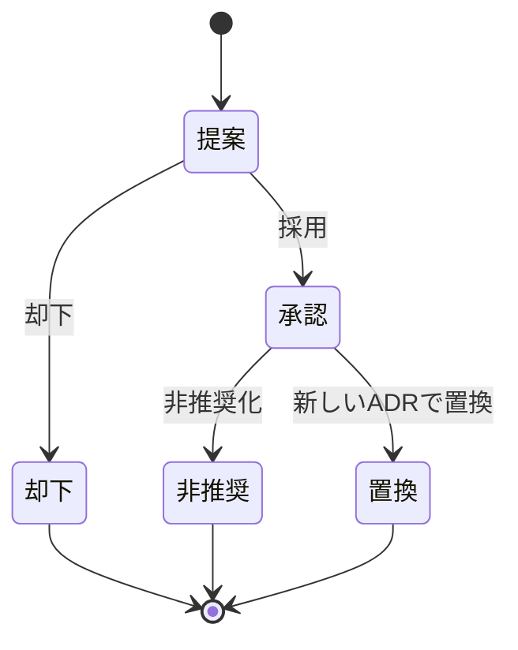

# アーキテクチャ決定記録（ADR）

このディレクトリには、勘定くんのアーキテクチャ上の重要な意思決定を ADR（Architecture Decision Record）として記録する。

## 方針

- 技術スタック選定、ドメインモデルの構造、債務グラフの最小送金簡約アルゴリズム、権限モデル、外部送金サービス連携など、重要な技術判断を記録する。
- 2名体制で「何を・なぜ・どういう結果になるか」を後から追えるようにし、認識を揃える。意思決定の経緯がチャット等に散逸するのを防ぐ。

## 書式

- ファイル名は `NNNN-kebab-summary.md`（4桁連番 + ケバブケースの要約。例 `0001-select-tech-stack.md`）。
- 各 ADR は Michael Nygard 形式に倣い、日本語で記述する。節は次の4つ:
  - **ステータス**: 提案 / 承認 / 却下 / 非推奨 / 置換
  - **文脈**: どんな背景・制約のもとで判断が必要か
  - **決定**: 何を採用すると決めたか
  - **結果**: 採用により生じる良い点・悪い点・今後の影響
- 決定を覆す場合は、旧 ADR のステータスを更新し（例: 「ADR-XXXX により置換」）、新 ADR から旧 ADR を参照する。過去の ADR は削除せず履歴として残す。

## ステータスの遷移

## 一覧

- まだ ADR はありません。最初の ADR として技術スタックの選定（`0001-...`）を記録する予定です。
