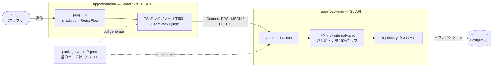

# アーキテクチャ — 勘定くん

勘定くんは、はしご飲みの立替を「誰が誰にいくら」の債務グラフとして可視化し、送金サービスへ遷移して精算まで導く Web アプリ。MVP は Web のみ（ネイティブは後続フェーズ）。本書は技術スタックと設計上の構造・不変条件を示す。物理配置は [directory-structure.md](directory-structure.md)、用語は [domain.md](domain.md) を参照。

## 全体像

React SPA と Go API を Connect-RPC で連携し、PostgreSQL に永続する（クライアント完結ではない）。FE と BE は `packages/proto/` の protobuf を型の単一の源として共有する。



*実線 = 実行時のリクエスト／データの流れ。点線 = ビルド時に `packages/proto/` の1定義から Go と TS を生成し、FE↔BE の型を一致させる。*

## 技術スタック

### フロントエンド
- React + TypeScript — 言語・UI
- Vite — ビルド / dev サーバ
- TanStack Router + TanStack Query — ルーティング・サーバ状態
- Zustand — クライアント状態
- Tailwind CSS + shadcn/ui — スタイリング・UI コンポーネント
- React Flow — グラフ可視化
- React Hook Form + Zod — フォーム・バリデーション
- 設計: **Feature-Sliced Design (FSD)**

### バックエンド
- Go — 言語
- net/http + Connect — サービング（RPC handler）
- GORM — DB アクセス（ORM）
- goose — マイグレーション
- caarlos0/env + godotenv — 設定
- PostgreSQL — データベース

### FE↔BE 契約
- Connect-RPC + buf（protobuf）— 型の単一の源。Go stub と TS クライアントを生成

### モノレポ / ビルド
- Taskfile（go-task）— 横断タスクの入口
- pnpm — JS パッケージ管理（apps/frontend は単独プロジェクト）
- mise — Go / Node のバージョン固定（各サブプロジェクトに配置）

### テスト
- Vitest + Testing Library — FE ユニット / コンポーネント
- Playwright — E2E
- Storybook — コンポーネントカタログ
- testing + testify + testcontainers-go — Go

### 開発ツール
- Biome — JS/TS の lint・format
- gofmt + golangci-lint — Go の lint・format
- lefthook — Git hooks
- Docker Compose — ローカル PostgreSQL

### インフラ / CI
- GitHub Actions — CI/CD
- Docker — Go のマルチステージビルド
- デプロイ先 — 形は確定・ベンダ保留（下記「インフラ」）

## コードマップ

読み始める場所。詳細な配置は [directory-structure.md](directory-structure.md)。ファイル名はシンボル検索で辿る。

```
apps/backend/
├── cmd/kanjo/main.go       # 入口。依存を結線してサーバ起動
└── internal/
    ├── kanjo/              # ★ ドメインの中核: 型 + 店舗/債務グラフの算法（純関数）
    ├── postgres/           # GORM リポジトリ・トランザクション
    ├── connect/            # Connect handler（RPC の入口）
    ├── kotra/ paypay/ ocr/ # 送金・レシート AI の外部連携（phase-2）
    └── gen/                # buf 生成の Go stub
apps/frontend/src/
├── app/                    # 入口。プロバイダとルート結線
├── widgets/                # 店舗グラフ・債務グラフの描画（React Flow）
├── features/ entities/     # ユーザー操作 / ドメインエンティティ
└── shared/                 # ui・lib・api・生成クライアント
packages/proto/kanjo/v1/    # FE↔BE 契約の protobuf（buf generate の入力）
```

## 設計上の不変条件

コードから読み取りにくい構造的な制約。変更時はこれらを保つ。

- **ドメインは外部を知らない**。`internal/kanjo` は DB・HTTP・protobuf に依存しない。DB/RPC はアダプタ（`postgres`/`connect`）に閉じる。
- **依存は一方向**。アダプタ → ドメイン。逆向きの依存を作らない。
- **型の単一の源は `packages/proto/`**。FE↔BE の型は protobuf から生成し、手書きの型で二重定義しない。
- **フロントの import は下位レイヤ方向のみ**（FSD）。同一レイヤのスライス間は public API 経由。
- **金額は整数（円）**。浮動小数点で金額を扱わない。
- **導出値は永続しない**。永続するのは支払い済み額のみ。金額・残額・精算完了は常に導出する。計算の正は `internal/kanjo`。

## 横断的関心事

- **金融トランザクション（必須）**。財務状態を変える操作（精算の記録・会計作成に伴う債務生成・金額編集）は必ず DB トランザクション内で行う。境界はサービスメソッドに置き、二重計上は行ロック／楽観ロックで防ぐ。
- **認証**。MVP では持たない。誰でも閲覧・編集できる（[requirements.md](requirements.md)）。
- **API 通信**。Connect-RPC は JSON over HTTP/1.1 で curl・devtools からデバッグでき、TS 側は connect-query で TanStack Query と連携する。

## インフラ

CI/CD は GitHub Actions（Go は Docker マルチステージビルド）。デプロイ先の**形は確定、ベンダは保留**（実デプロイ時に後続 issue / ADR で決定）。

| ピース | 形 | 候補（未確定） |
| --- | --- | --- |
| FE ホスティング | 静的 SPA 配信 | Cloudflare Pages / Vercel |
| BE 実行 | Go コンテナ実行 | Fly.io / Cloud Run / Railway |
| DB | マネージド PostgreSQL | Neon / Supabase |

## 関連ドキュメント

- [directory-structure.md](directory-structure.md) — ディレクトリ構成の詳細
- [requirements.md](requirements.md) — 要件定義
- [domain.md](domain.md) — ドメイン用語・ドメインモデル
- [workflow.md](workflow.md) — 開発フロー
- [adr/](adr/) — アーキテクチャ決定記録
