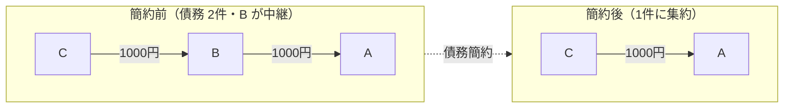
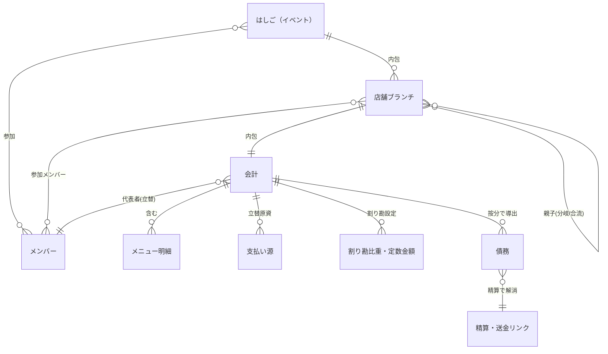
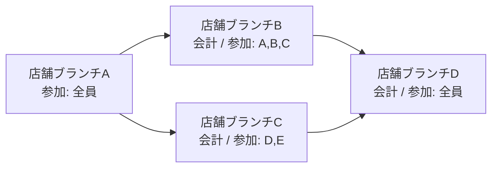
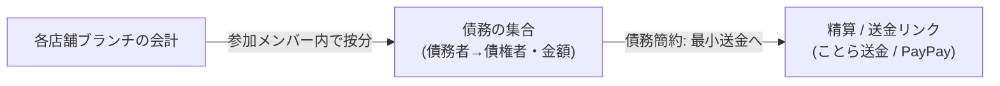

# ドメインモデル — 勘定くん

本書は勘定くんのドメイン用語集と初期ドメインモデルの草案をまとめたものである。

> 注意: 本書はあくまで**草案**である。技術スタック（FE/BE/言語/フレームワーク/DB/インフラ）は未定であり、永続化方法・スキーマ・実装言語上の型は確定していない。エンティティ名・属性・関連は今後の設計で変更されうる。スタック依存の詳細は（技術スタック決定後に記載 / docs/architecture.md 参照）。

## ドメイン用語（統一して使う）

| 用語 | 定義 |
| --- | --- |
| 会計 | 1店舗・1回分の支払い。店名・会計時刻・合計金額・メニュー明細を持つ。 |
| 店舗ブランチ | はしご内の各店舗訪問を表すノード（1会計を内包）。Git のブランチに着想を得た命名で、グループの分岐（一部メンバーが別の店へ）・合流を表す。その店の参加メンバー内で会計を割り勘する。 |
| はしご（イベント） | 1回の催し。複数の店舗ブランチからなるグラフ（Git のコミットグラフに相当）。グループは分岐し、合流する場合もしない場合もある。 |
| 代表者 | その会計を立て替えて支払った人。 |
| メンバー | 割り勘の参加者。 |
| 支払い源 | 代表者が立替に用いた原資（単一/複数）。 |
| 依存関係（債務グラフ） | 「誰が誰にいくら」を表す有向グラフ。 |
| フローチャート | 依存関係の可視化（権限により本人のみ表示/全体一覧表示が変わる）。 |
| 割り勘比重 | 参加者ごとの負担割合。 |
| 定数金額 | 比重に依らない固定負担額。 |
| 精算 | 送金により債務を解消すること（ことら送金/PayPay へ遷移）。 |
| レシート自動入力 | AI でレシートを会計データ（JSON）へ変換するサブスク機能。 |

## 中核技術課題: 債務グラフの最小送金簡約

勘定くんの中核となる技術課題は、**「誰が誰にいくら」の債務グラフ（依存関係）を、最小回数の送金へ簡約する精算ロジック（債務簡約）**である。

- はしごで会計が積み重なると、メンバー間に多数の細かい債務が発生する。
- これらを各人の純収支（差し引きの貸し借り）に集約し、必要な送金の回数・件数を最小化する。
- 集約後も合計金額が一致することを保証し、端数処理の方針を別途定める（今後検討）。
- アルゴリズムの具体実装は（技術スタック決定後に記載 / docs/architecture.md 参照）。

例（B が中継となり相殺されるケース）:

## 初期ドメインモデル草案

### エンティティ一覧

- **はしご（イベント）**: 1回の催し。複数の店舗ブランチが分岐・合流しうる**グラフ（DAG）**として束ねる（Git のコミットグラフに相当）。参加メンバーの集合を持つ。
- **店舗ブランチ**: はしご内の各店舗訪問を表すノード（Git のコミットに相当）。1つの会計を内包する。直前に一緒にいた店舗ブランチ（親）への参照を持ち、分岐すると1つの親から複数の子、合流すると複数の親を持つ子が生まれうる（合流は任意）。**その店に実際にいたメンバーの部分集合（参加メンバー）**を持ち、会計はその参加メンバー内で割り勘される。「ブランチ」という名は Git のブランチに由来する。
- **会計**: 1店舗・1回分の支払い。店名・会計の時間（文字列）・合計金額・メニュー明細・代表者・支払い源・割り勘設定（比重/定数金額）を持つ。
- **メニュー明細**: 会計に含まれる品目。品名・単価・注文個数を持つ。
- **メンバー**: 割り勘の参加者。はしごに参加する人。
- **代表者**: その会計を立て替えたメンバー（会計ごとに定まる役割）。
- **支払い源**: 代表者が立替に用いた原資。単一または複数。
- **債務**: 「誰（債務者）→ 誰（債権者）・いくら（金額）」を表す有向エッジ。会計の割り勘結果から導出される。
- **割り勘比重 / 定数金額**: 各メンバーの負担を決める設定。比重（割合）と定数金額（固定額）を持つ。
- **精算 / 送金リンク**: 債務を解消する送金。ことら送金/PayPay 等への遷移情報（送金リンク）と、支払い済み金額の記録を持つ。

### 関連（リレーション）

補足（図で表しきれない点）:

- 店舗ブランチ同士の親子関係は全体として **DAG（有向非巡回グラフ）**。分岐で1親→複数子、合流で複数親→1子（合流は任意。一直線の順序ではない）。
- **代表者**は会計ごとに定まる「メンバーの役割」であり、独立した人物エンティティではない。
- はしご全体の債務集合は、上記の **債務簡約** を経て最小化された精算（送金）集合になる（「中核技術課題」の図を参照）。

### 図解（概念レベル）

店舗ブランチのグラフ（Git のコミットグラフに相当 / 合流は任意）:

各店舗ブランチは1つの会計を内包し、会計は「店名・会計の時間[文字列]・合計金額・メニュー明細（品名/単価/注文個数）・代表者・支払い源・参加メンバー（その店にいたメンバーの部分集合）・割り勘比重/定数金額」を持つ。合流する場合・しない場合がある。

精算までの流れ:

## 関連ドキュメント

- 要件定義: docs/requirements.md
- 開発フロー: docs/workflow.md
- アーキテクチャ決定記録: docs/adr/
