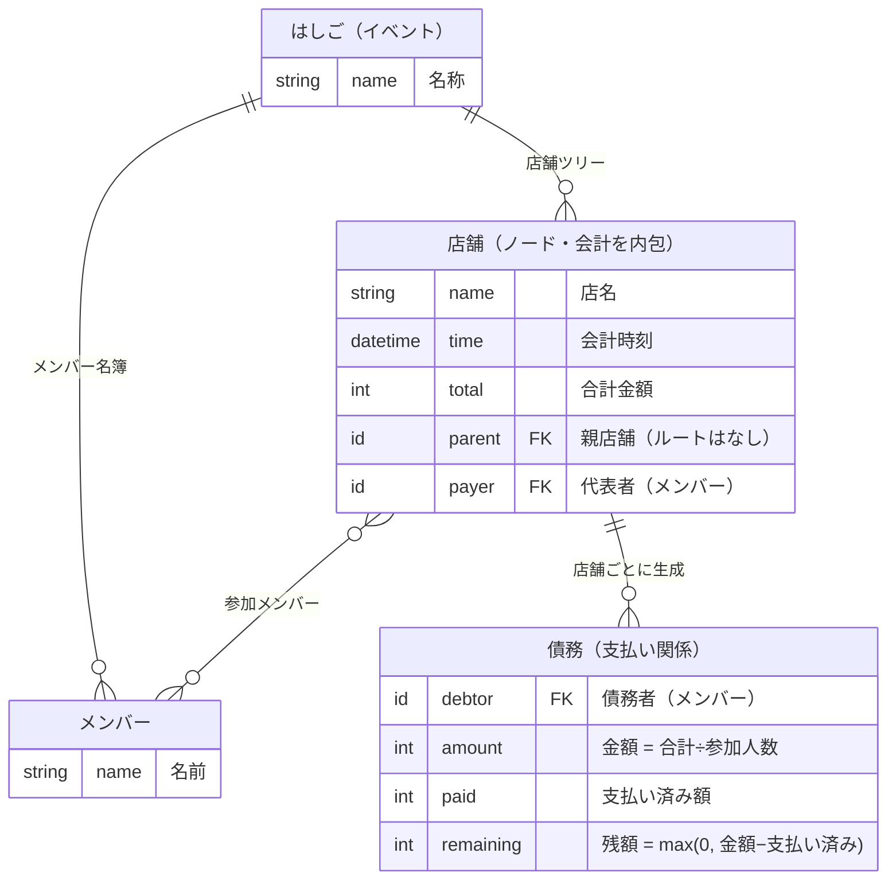
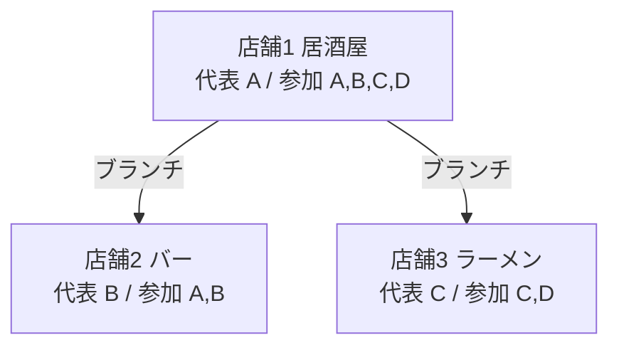
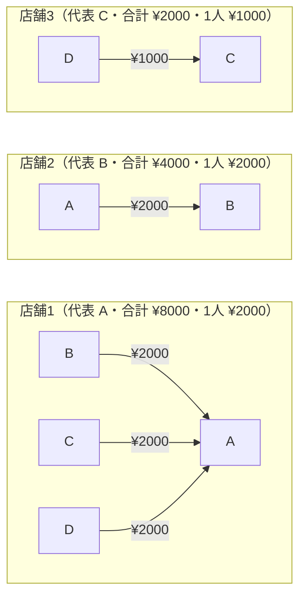
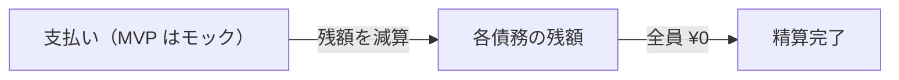

# ドメインモデル — 勘定くん

本書は勘定くんのドメイン用語と MVP のドメインモデルを定義する。記述は日本語。技術スタックは未定（スタック依存は docs/architecture.md 参照）。要件は docs/requirements.md を参照。

本サービスは **2 種類のグラフ** を扱う。両者は別物であり、混同しない。

- **店舗グラフ（イベント構造）**: ノード = 店舗、エッジ = ブランチ（分岐）。
- **債務グラフ（金銭）**: ノード = メンバー、エッジ = 支払い（誰 → 誰 ¥いくら）。

## 用語

### 店舗グラフ（イベントの構造）

| 用語 | 定義 |
| --- | --- |
| はしご（イベント） | 1 回の飲み会全体。複数の店舗からなるグラフ。MVP は分岐のみ（ツリー）。参加メンバー全体（名簿）を持つ。 |
| 店舗（ノード） | ハシゴ中の、ある店での 1 回の訪問。1 つの会計を内包し、代表者 1 名と参加メンバー（名簿の部分集合）を持つ。 |
| ブランチ（分岐） | ある店舗から次の店舗へ派生するエッジ。グループの分岐（別々の N 次会）を表す。Git のブランチに着想。エッジであってノードではない。 |

### 債務グラフ（金銭の関係）

| 用語 | 定義 |
| --- | --- |
| メンバー | 飲み会の参加者。 |
| 代表者 | その店舗の会計を立て替えたメンバー（店舗ごとに定まる役割）。 |
| 会計 | 1 店舗・1 回分の支払い。店名・会計時刻・合計金額を持つ（メニュー明細は任意）。MVP は均等割り。 |
| 割り勘 | 会計を参加メンバーで分けること。MVP は均等割り。 |
| 債務（支払い関係） | 「メンバー（債務者）→ その店の代表者（債権者）・¥金額」の矢印。MVP は各店舗ごとに素直に列挙（簡約しない）。 |
| 債務グラフ（依存関係） | 債務（矢印）の集合。 |
| 残債 | ある債務の未払い額。支払いで減算する。 |
| 精算 | 支払いにより残債を解消すること。MVP は送金モックで記録。 |
| 精算完了 | 全メンバーの残債が ¥0 になった状態（飲み会単位）。 |

> 機能追加フェーズで登場する用語（債務簡約 / 送金リンク（実送金遷移）/ 割り勘比重・定数額 / 支払い源 / 合流（マージ）/ レシート自動入力）は MVP では扱わない。

## エンティティ（MVP）

- **はしご（イベント）**: メンバー名簿、店舗（ツリー）を持つ。「精算完了」は全債務の残額が ¥0 で導出する（フラグは持たない）。
- **店舗（ノード）**: 親店舗への参照（＝ブランチ。ルートは親なし）、会計情報（店名・会計時刻・合計金額・**メニュー明細〔任意〕**）、代表者（メンバー 1 名）、参加メンバー（名簿の部分集合）。**会計は店舗ノードに内包**する（1 店舗 = 1 会計）。
- **メンバー**: 名前（送金先情報は機能追加フェーズ）。
- **債務（支払い関係）**: 店舗 × 参加メンバー（代表者を除く）ごとに 1 つ。債務者（メンバー）／債権者（その店の代表者）／金額 = 合計金額 ÷ 参加人数（均等割り・導出）／支払い済み額（記録）／残額 = max(0, 金額 − 支払い済み額)。**代表者自身には債務は生じない**（自分の負担は立替で充当済み）。

補足（編集と既払いの整合）: 誰でも編集可のため、支払い記録後に合計金額・参加人数が変わると割り勘額も変わる。MVP は「**金額は常に最新値から導出・支払い済み額のみ記録・残額 = max(0, 金額 − 支払い済み)**」とし、過払いは**トースト警告にとどめる**（本対処は機能追加フェーズ）。

### エンティティ関連（ER）

親店舗（ブランチ）・代表者・債務者は**外部キー（FK）属性**として各エンティティ内に持たせ、関係線は主要な 4 本（はしご↔店舗・はしご↔メンバー・店舗↔参加メンバー・店舗↔債務）に絞っている。自己ループ（店舗の親子）は線にせず `parent` 属性で表す。債権者は「その店舗の代表者（`payer`）」であり導出される。

## 店舗グラフの例（分岐ツリー）

店舗1 の後、グループが店舗2 と店舗3 に分岐した例。

## 債務グラフの例（店舗ごとの矢印列挙）

上の例で各店舗の会計を参加メンバーで均等割りすると、債務（矢印）は店舗ごとに次のようになる（簡約はしない）。

## 精算の流れ

## 関連ドキュメント

- 要件定義: docs/requirements.md
- 開発フロー: docs/workflow.md
- アーキテクチャ決定記録: docs/adr/
