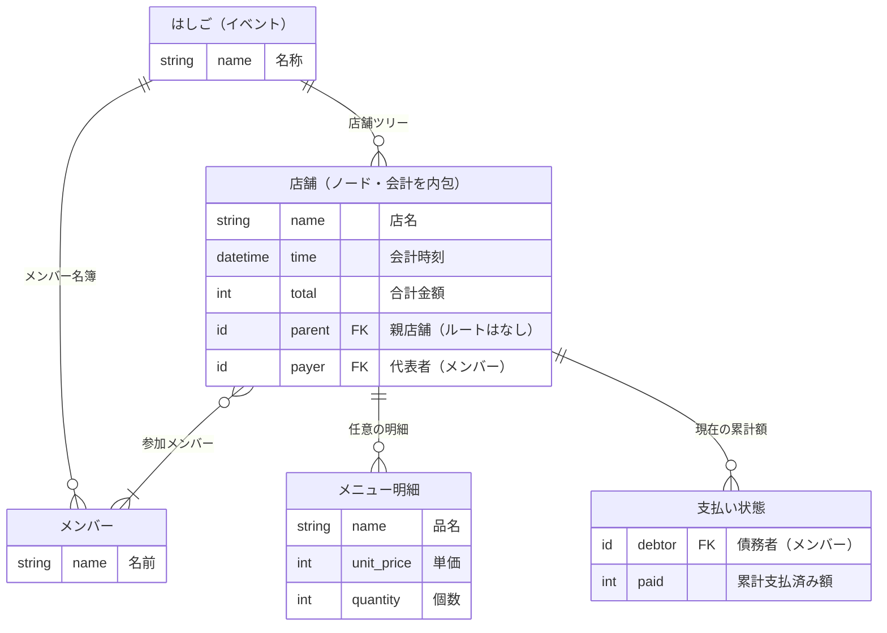
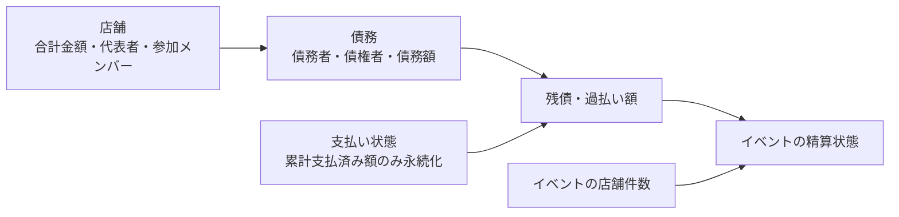
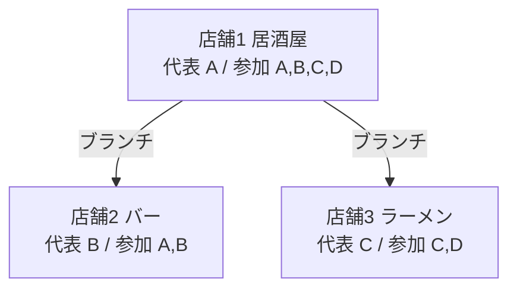
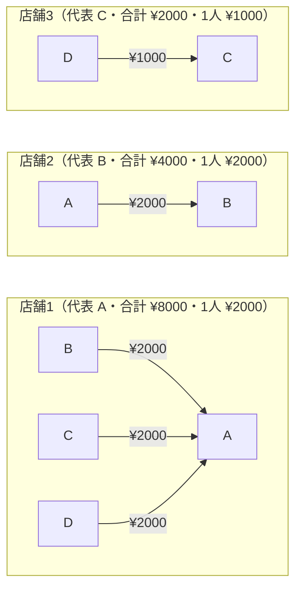
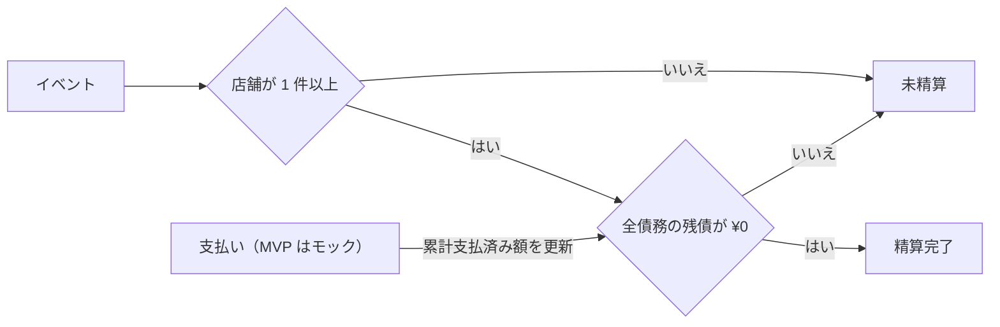

# ドメインモデル — 勘定くん

本書は勘定くんのドメイン用語と MVP のドメインモデルを定義する。記述は日本語。技術スタックとアーキテクチャは [docs/architecture.md](architecture.md)、要件は [docs/requirements.md](requirements.md) を参照する。

本サービスは **2 種類のグラフ** を扱う。両者は別物であり、混同しない。

- **店舗グラフ（イベント構造）**: ノード = 店舗、エッジ = ブランチ（分岐）。
- **債務グラフ（金銭）**: ノード = メンバー、エッジ = 債務（誰 → 誰 ¥いくら）。

## 用語

### 店舗グラフ（イベントの構造）

| 用語 | 定義 |
| --- | --- |
| はしご（イベント） | 1 回の飲み会全体。店舗 0 件の状態を許容し、店舗がある場合は単一ルートの分岐ツリーを持つ。参加メンバー全体（名簿）を持つ。 |
| 店舗（ノード） | ハシゴ中の、ある店での 1 回の訪問。1 つの会計を内包し、参加メンバーのうち代表者 1 名と、親店舗への参照（ルートを除く）を持つ。 |
| ブランチ（分岐） | ある店舗から次の店舗へ派生するエッジ。グループの分岐（別々の N 次会）を表す。Git のブランチに着想。エッジであってノードではない。 |

### 債務グラフ（金銭の関係）

| 用語 | 定義 |
| --- | --- |
| メンバー | 飲み会の参加者。 |
| 代表者 | その店舗の会計を立て替えたメンバー（店舗ごとに定まる役割）。 |
| 会計 | 1 店舗・1 回分の支払い。店名・会計時刻・合計金額を持つ。MVP は均等割り。 |
| メニュー明細 | 会計に任意で記録する品名・単価・個数。明細の合計ではなく、会計に入力した合計金額を割り勘の正とする。 |
| 割り勘 | 会計を参加メンバーで分けること。MVP は均等割り。 |
| 債務（支払い関係） | 「メンバー（債務者）→ その店の代表者（債権者）・¥金額」の矢印。会計と参加メンバーから導出し、MVP は各店舗ごとに素直に列挙する（簡約しない）。 |
| 債務グラフ（依存関係） | 債務（矢印）の集合。 |
| 支払い状態 | 店舗 × 債務者ごとの現在の累計支払済み額。支払い 1 回ごとの履歴は持たない。 |
| 残債 | ある債務の未払い額。債務額と累計支払済み額から導出する。 |
| 過払い額 | 累計支払済み額が債務額を超えた金額。過払いを許容し、解消されるまで警告する。 |
| 精算 | 支払いにより残債を解消すること。MVP は送金モックで記録。 |
| 精算完了 | 店舗が 1 件以上あり、全債務の残債が ¥0 になった状態（イベント単位）。 |

> 機能追加フェーズで登場する用語（債務簡約 / 送金リンク（実送金遷移）/ 割り勘比重・定数額 / 支払い源 / 合流（マージ）/ レシート自動入力）は MVP では扱わない。

## エンティティと導出モデル（MVP）

- **はしご（イベント）**: メンバー名簿と店舗ツリーを持つ。精算完了は保存せず、店舗件数と全債務の残債から導出する。
- **店舗（ノード）**: 親店舗への参照（＝ブランチ。ルートは親なし）、会計情報（店名・会計時刻・合計金額・任意のメニュー明細）、代表者（参加メンバー 1 名）、参加メンバー（名簿の部分集合）を持つ。**会計は店舗ノードに内包**する（1 店舗 = 1 会計）。
- **メニュー明細**: 品名・単価・個数を持ち、店舗に 0 件以上属する。割り勘額の計算元にはしない。
- **メンバー**: 名前を持つ（送金先情報は機能追加フェーズ）。
- **支払い状態**: 店舗 × 債務者ごとに累計支払済み額だけを保持する。同じ組み合わせの現在値は 1 つであり、個別の支払い履歴は保持しない。
- **債務（導出モデル）**: 店舗 × 参加メンバー（代表者を除く）ごとに、債務者・債権者・債務額・累計支払済み額・残債・過払い額を構成する。債務額・残債・過払い額は永続化しない。**代表者自身には債務を作らない**（自分の負担は立替で充当済み）。

### 均等割りと精算額の導出

参加人数を `n`、合計金額を `total` とする。代表者を必ず参加メンバーに含めるため `n` は 1 以上となる。金額は整数円で扱う。

- 基本負担額 `base = floor(total ÷ n)`
- 余り `remainder = total mod n`
- 代表者以外の債務額 `amount = base`
- 代表者の自己負担額 `base + remainder`
- 残債 `remaining = max(0, amount − paid)`
- 過払い額 `overpaid = max(0, paid − amount)`

ここで `paid` は支払い状態に保存した累計支払済み額である。債権者は店舗の代表者から、債務者は代表者以外の参加メンバーから導出する。

### 店舗ツリーの不変条件

- 店舗が 0 件のイベントを許容する。店舗が 1 件以上ある場合は、親を持たないルートを必ず 1 件とし、ルート以外は同じイベント内の親を 1 件持つ。
- 親店舗の変更は、変更後も単一ルートを維持し、循環が生じない場合だけ許可する。
- 子店舗がある店舗、または累計支払済み額が ¥1 以上の参加メンバーがいる店舗は削除できない。
- 店舗作成時の参加メンバーは、その時点のイベントメンバー全員を初期値とする。以後に追加したイベントメンバーは既存店舗へ自動追加しない。

### 支払い後の編集規則

- 支払い記録後も合計金額を変更し、参加メンバーを追加できる。代表者を除く累計支払済み額が ¥0 の参加メンバーは削除できる。
- 編集前の累計支払済み額は維持し、債務額・残債・過払い額を最新の会計と参加メンバーから再計算する。過払いが生じても編集を許容し、解消されるまで警告する。
- 累計支払済み額が ¥1 以上の参加メンバーは店舗から削除できない。いずれかの参加メンバーの累計支払済み額が ¥1 以上の場合、代表者の変更と店舗の削除を拒否する。
- 累計支払済み額を ¥0 に訂正すると未払い状態へ戻り、支払いに由来する編集制限を解除する。

### 永続エンティティ関連（ER）

親店舗（ブランチ）・代表者・債務者は**外部キー（FK）属性**として各エンティティ内に持たせる。自己ループ（店舗の親子）は線にせず `parent` 属性で表す。支払い状態は店舗と債務者の組み合わせで一意とする。

債務は永続エンティティではなく、次の入力から構成する導出モデルである。

債務額・残債・過払い額・精算完了は保存せず、常に最新の店舗と支払い状態から導出する。

## 店舗グラフの例（分岐ツリー）

店舗1 の後、グループが店舗2 と店舗3 に分岐した例。

## 債務グラフの例（店舗ごとの矢印列挙）

上の例で各店舗の会計を参加メンバーで均等割りすると、債務（矢印）は店舗ごとに次のようになる（簡約はしない）。

### 端数が発生する例

代表者 A、参加メンバー A・B・C、合計金額 ¥10,000 の場合、基本負担額は `floor(10,000 ÷ 3) = 3,333`、余りは ¥1 となる。B と C はそれぞれ A へ ¥3,333 の債務を持ち、A の自己負担は ¥3,334 となるため、負担額の合計は会計の合計金額と一致する。

## 精算の流れ

## 関連ドキュメント

- 要件定義: docs/requirements.md
- 開発フロー: docs/workflow.md
- アーキテクチャ決定記録: docs/adr/
