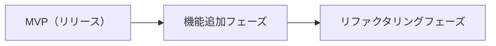

# 要件定義書 — 勘定くん

本書は「勘定くん」の要件を定義する。記述は日本語で統一する。技術スタックとアーキテクチャは [docs/architecture.md](architecture.md) を参照する。

本書は **MVP** と **機能追加フェーズ** を明確に分けて記述する。

## 目的・背景

割り勘では、まず代表者がその場の支払いを立て替え、後からメンバーが代表者へ返す、という流れになることが多い。これが複数店舗を巡るハシゴになると会計が積み重なり、さらにメンバーが別々の N 次会へ分岐すると、「誰が誰にいくら払うのか」という金銭の依存関係が複雑になり、支払いがなぁなぁになってしまう。

勘定くんは、この依存関係を「**誰 → 誰 ¥いくら**」という**矢印の列挙**として店舗ごとに分かりやすく一覧化し、送金まで面倒を見ることで、ハシゴ後の精算を確実に完了させることを目的とする。

## 対象ユーザー

- 割り勘で金銭のやり取りをしっかりと行いたいユーザー。
- 飲み会の幹事で、お金の管理がうまくできていないユーザー。

## 基本概念: 2 つのグラフ（重要）

本サービスは **2 種類のグラフ** を扱う。両者は別物であり、混同しない。

- **店舗グラフ（イベントの構造）**: ノード = **店舗（その店での 1 回の訪問。1 つの会計を持つ）**、エッジ = **ブランチ（ある店舗から次の店舗への分岐）**。Git のコミットグラフに着想を得ており、グループの分岐（別々の N 次会）を表す。
- **債務グラフ（金銭の関係）**: ノード = **メンバー**、エッジ = **「誰 → 誰 ¥いくら」の債務**。これを矢印の列挙として一覧化する。

用語: 「**ブランチ**」は**店舗から派生するエッジ**を指す。店舗自体は**ノード**である。図解・エンティティ定義は docs/domain.md を参照。

## ユーザーストーリー

- 幹事 / 参加者として、ハシゴの店舗構成（分岐を含む）を登録したい。
- 代表者として、自分が立て替えた店舗の会計（合計金額など）を入力したい。
- メンバーとして、各店舗で自分が代表者にいくら払うべきかを「矢印の一覧」で把握したい。
- 参加者として、支払いを行い（MVP ではモック）、残債が減るのを確認したい。店舗が 1 件以上あり、最終的に全員の残債が ¥0 になれば、その飲み会の精算は完了。

## スコープとロードマップ



- **MVP**: 認証なし・均等割り・**簡約なし**・送金はモック、という最小構成で「依存関係の可視化＋精算記録」を検証する。
- **機能追加フェーズ**: 簡約・実送金連携・権限・比重/定数額・合流・レシート AI 入力 などを追加する。
- **リファクタリングフェーズ**: モデル整理・構成見直し・テスト整備・Storybook 整備。

## MVP の機能要件

### 1. 店舗グラフの構築（分岐ツリー）

- ハシゴを店舗（ノード）とブランチ（分岐エッジ）で構成する。
- イベント作成直後は店舗が 0 件でもよい。店舗が 1 件以上ある場合、親を持たない**ルート店舗は必ず 1 件**とし、それ以外の店舗は同じイベント内の店舗を 1 件だけ親に持つ。
- **分岐のみ（単一ルートのツリー）**。合流（マージ）は MVP では扱わない。
- 親店舗は変更できる。ただし、変更後も単一ルートを維持し、同じイベント内で循環が生じない場合に限る。
- 子店舗がある店舗、または累計支払済み額が ¥1 以上の参加メンバーがいる店舗は削除できない。

### 2. メンバー管理

- 飲み会（イベント）の参加メンバーを登録する。
- 各店舗の参加メンバーは、**店舗作成時点のイベントメンバー全員を初期値**とし、そこから**追加・削除**できる（分岐時に誰がどの枝へ進むかは不明なため、全員から絞り込む方式）。
- 店舗作成後にイベントへ追加したメンバーは、既存店舗の参加メンバーへ自動追加しない。
- 同じメンバーが**兄弟ブランチ（同時刻の別 N 次会）に重複**して存在する間は、トースト等で警告し続ける（重複自体は一時的に許容し、ハードブロックはしない）。親 → 子の連続した店舗に同じメンバーがいるのは正常。

### 3. 会計（各店舗）

- 各店舗の会計は、参加メンバーに含まれる**代表者 1 名**が立て替える。
- 会計は店名・会計時刻・**合計金額**を持つ。メニュー明細は品名・単価・個数を任意で記録できるが、明細の合計ではなく入力した合計金額を割り勘の正とする。
- 割り勘は参加メンバーで**整数円の均等割り**とする。基本負担額は `floor(合計金額 ÷ 参加人数)` とし、代表者以外の参加メンバーは基本負担額を負担する。
- 割り切れない余りは代表者の自己負担へ加算する。代表者自身への債務は作らない。

### 4. 債務グラフ（矢印の列挙）

- 各店舗ごとに「**その店のメンバー → その店の代表者 ¥金額**」を**素直に列挙**する。
- MVP では**簡約・合算を一切行わない**（店舗ごとにそのまま並べる）。

### 5. 精算

- 店舗 × 債務者ごとに**累計支払済み額だけを記録**し、支払い 1 回ごとの履歴は保持しない。
- 各矢印に対して全額または部分的な支払いを記録できる。残債は `max(0, 債務額 − 累計支払済み額)`、過払い額は `max(0, 累計支払済み額 − 債務額)` として常に導出する。
- **店舗が 1 件以上あり、すべての債務の残債が ¥0 になった時点で、その飲み会の精算を完了**とする。店舗が 0 件のイベントは精算完了としない。
- MVP の送金は**モック**（「支払った」という記録を確実に取れる状態を作る）。実際のことら送金 / PayPay 連携は機能追加フェーズで行う。

### 6. 入力・編集

- データの入力・修正は**誰でも**行える（MVP では認証を設けない）。
- 支払い記録後も合計金額を変更し、参加メンバーを追加できる。代表者を除く累計支払済み額が ¥0 の参加メンバーは削除できる。編集前の累計支払済み額は維持し、債務額・残債・過払い額を最新の会計と参加メンバーから再計算する。
- 再計算によって過払いが生じても編集を許容し、過払いが解消されるまで警告する。
- 累計支払済み額が ¥1 以上の参加メンバーは店舗から削除できない。いずれかの参加メンバーの累計支払済み額が ¥1 以上の場合、代表者の変更と店舗の削除を拒否する。
- 累計支払済み額を ¥0 に訂正した場合、そのメンバーを未払いとして扱い、支払いに由来する編集制限を解除する。

### 7. 表示

- MVP では全体が見える前提とする（**権限別表示は MVP では扱わない**）。

## 機能追加フェーズ（MVP 後）

- **債務簡約（2 種）**:
  - 簡易簡約: 同一ペア（支払者 → 受取者）の複数債務を合算し、送金回数を減らす。
  - 複雑な簡約: イベント全体を最小回数の送金へ集約する。代表者交代に伴う member → member の経由も考慮する。
  - 送金導線は簡約版の矢印クリックに切り替える。各店舗ビューと簡約ビューは同じ債務の別表現のため、**残債は 1 つの正に統一して二重支払いを防ぐ**。
- **実送金連携**: ことら送金 / PayPay への遷移と、送金先情報の確定（MVP はモック）。
- **割り勘の比重 / 定数額**: メンバーごとの負担割合、特定メンバーへの固定額。
- **権限別表示**: 自分が代表者の店舗は全体可視、メンバーの店舗は自分の分のみ。
- **合流（マージ）**: 分かれたメンバーの再合流。店舗グラフが DAG 化する。
- **レシート AI 自動入力（サブスク）**: レシート画像を会計データ（JSON）へ変換する。会計データ例:

  ```json
  {
    "店名": "居酒屋さくら 新宿店",
    "会計の時間": "2026-06-25 19:42",
    "会計時の金額": 12800,
    "メニュー": [
      { "品名": "生ビール", "単価": 600, "注文個数": 4 },
      { "品名": "枝豆", "単価": 400, "注文個数": 2 },
      { "品名": "唐揚げ", "単価": 700, "注文個数": 3 }
    ]
  }
  ```

- **支払い源管理**: 単一 / 複数の支払い源。

## 非機能要件

分かる範囲で記載する。不明な点は今後検討とする。

- 言語・記述: ドキュメント・UI 文言は日本語を基本とする。
- 精算の正確性: 金額は整数円で扱い、均等割りの余りは代表者が負担して、各参加メンバーの負担額の合計を会計の合計金額と一致させる。
- データ整合性: 単一ルート・循環禁止・支払済みデータを保護する編集制限は、違反する操作を拒否する。兄弟店舗のメンバー重複と過払いは操作を許容し、解消されるまで警告する。
- プラットフォーム・データ保持・課金（サブスク）基盤など、MVP で定めていない事項は今後検討する。技術スタックは [docs/architecture.md](architecture.md) を参照する。

## リファクタリングフェーズ

- モデル整理 / ディレクトリ構成の見直し / テスト整備 / Storybook 整備。

## 関連ドキュメント

- ドキュメント案内: docs/README.md
- ドメインモデル: docs/domain.md
- 開発フロー: docs/workflow.md
- アーキテクチャ決定記録: docs/adr/
