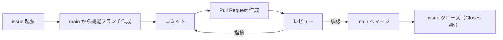

# 開発フロー — 勘定くん

勘定くんの開発フロー（Git 運用・レビュー・issue/PR・体制）の要点をまとめる。記述は日本語。
規約はできるだけ縛らない方針（commitlint 等の検証ツールを導入していないため、形式の強制はしない）。

## 開発体制

- 自分＋先輩エンジニアの2名体制。役割は流動的。
- 設定・運用ルールの変更も PR で共有し、2名で認識を合わせる。

## ブランチ運用: GitHub Flow

- `main` を常にデプロイ可能な安定ブランチとして維持する。
- 作業は `main` から機能ブランチを切り、機能ブランチ → Pull Request → レビュー → `main` へマージ、で進める。
- **`main` への直コミット / 直 push は禁止**（必ず PR 経由）。

## コミット / ブランチ / PR の書き方

形式は縛らない。**変更内容が分かれば自由**でよい。

- コミットメッセージ: 日本語で、何をしたかが分かるように書く。`feat:` などの接頭辞を付けたい人は付けてよい（任意）。
- ブランチ名: 分かりやすい名前であればよい。対応 issue があれば番号を含める（例 `12-receipt-input`）と追跡しやすい（任意の推奨）。
- PR タイトル: 自由。
- **守ること**: Co-Authored-By 等のトレーラ・署名は付与しない（コミット・PR・issue いずれも）。

## issue 運用

- 作業の起点として issue を作成し、目的・背景・完了条件を日本語で書く（テンプレートは `.github/ISSUE_TEMPLATE/`）。
- **マイルストーンは GitHub の Milestone 機能**で管理する（要件定義のロードマップを Milestone に対応づける）。
- ラベルは特定の体系を定めない。必要に応じて付ける。
- PR で `Closes #N` を書くと対応 issue が自動クローズされる。

## PR / レビュー運用

- base は必ず `main`。1 つの PR は1まとまりの変更に絞る（レビューしやすい粒度）。
- PR テンプレートは `.github/pull_request_template.md`（GitHub が自動適用）。
- レビューや動作確認には既存のビルトイン skill を活用する（再実装しない）:
  - `/code-review`（ローカル差分のコードレビュー） / `/review`（GitHub PR レビュー） / `/run`（起動確認） / `/verify`（動作検証）
- 2名体制では小さく早く PR を出し、相互レビューのリードタイムを短く保つ。レビュアーが対応できない場合も `main` 直 push はしない。

## マイルストーン

要件定義（docs/requirement.md）のロードマップを GitHub Milestone に対応づける。

- **〜リリース（MVP）**: 店舗ブランチとフローチャート / メンバー管理 / FE・BE 作成 / 依存関係表示（権限別）
- **〜第1回 機能追加**: 比重・定数金額管理 / 単一・複数の支払い源管理
- **〜第1回 リファクタリング**: モデル整理 / ディレクトリ構成見直し / テスト整備 / Storybook 整備

## 関連ドキュメント

- 案内: docs/README.md
- 要件定義: docs/requirement.md
- ドメインモデル: docs/domain.md
- アーキテクチャ決定記録: docs/adr/
